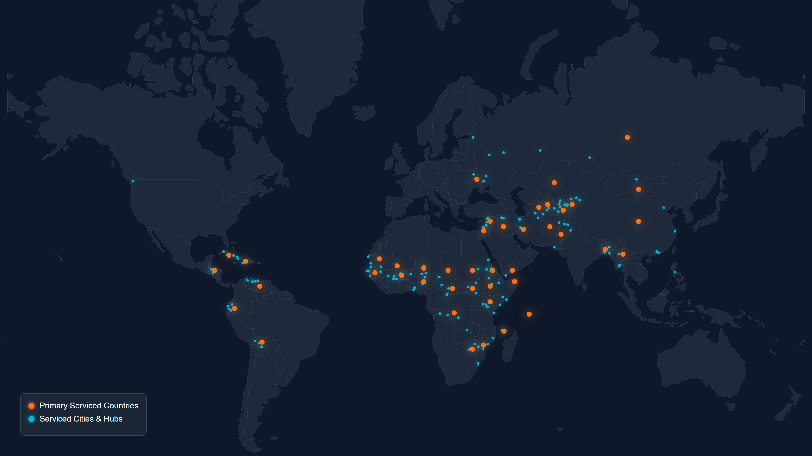

# TrueAid — Direct Aid Delivery & Operations Hub

[](https://expressjs.com)
[](https://react.dev)
[](https://reactnative.dev)
[](https://stripe.com)
[](https://tailwindcss.com)
[](https://www.typescriptlang.org/)
[](https://vitejs.dev)
[](https://pnpm.io)

TrueAid is an ultra-premium, high-performance, impact-driven platform designed to connect global generosity with local humanitarian needs. We bypass traditional administrative red tape to coordinate secure, on-the-ground food networks, warm blankets, and hot beverage distributions directly to evacuation centers and high-need regions globally.

<p align="center">
    
</p>

## 🌍 Our Mission

To bridge the gap between global donors and direct field recipients, ensuring absolute transparency, secure routing, and lightning-fast logistics to deliver tangible relief across borders.

<p align="center">
  
</p>

---

## 🏗️ Monorepo Architecture

TrueAid uses a **pnpm workspace monorepo** with a shared business logic package, enabling code reuse across platforms while maintaining separate UI layers:

```
TrueAid/
├── packages/
│   └── shared/              # @trueaid/shared — Shared business logic
│       ├── src/
│       │   ├── types.ts     # AidItem, CartItem, Country interfaces
│       │   ├── data.ts      # 47 countries + static aid item fallbacks
│       │   ├── contexts/    # CartProvider, useCart hook
│       │   └── index.ts     # Barrel exports
│       └── api/
│           ├── index.js     # createApiApp() Express factory
│           └── sync.js      # Stripe product sync logic
├── src/
│   ├── app/                 # Web/Tablet app (React + Vite + Tailwind v4)
│   └── mobile/              # Mobile app (React Native + Expo SDK 57)
├── api/                     # Web backend entry point
└── pnpm-workspace.yaml      # Workspace configuration
```

### Shared Package (`@trueaid/shared`)

The shared package extracts common business logic so both platforms stay DRY:

| Module | Description |
|--------|-------------|
| `types.ts` | Unified `AidItem`, `CartItem`, and `Country` TypeScript interfaces |
| `data.ts` | Full 47-country dataset + 8 static `aidItems` fallbacks |
| `contexts/CartContext.tsx` | Cart state management with `addToCart`, `addMultipleToCart`, target location tracking |
| `api/index.js` | `createApiApp()` factory — configurable Express server with Stripe routes |
| `api/sync.js` | Stripe product synchronization with metadata parsing |

### Platform-Specific UI Layers

| Platform | Framework | Styling | Routing | Target |
|----------|-----------|---------|---------|--------|
| **Web/Tablet** | React 18 + Vite | Tailwind CSS v4 | React Router v7 | `src/app/` |
| **Mobile** | React Native + Expo 57 | NativeWind + Tailwind CSS 3 | Expo Router | `src/mobile/` |

Both apps re-export shared logic through thin wrapper files, so existing import paths (`@/contexts/CartContext`, `@/data/countries`) continue to work unchanged.

---

## ✨ Key Features & Architectural Upgrades

### 🎨 Premium UI & Interactive Experiences
- **Highly Modular Component Architecture**: Restructured the monolithic homepage into high-cohesion, single-responsibility subcomponents to improve code maintainability, testing scalability, and rendering efficiency.
- **Interactive Dark Mode Toggle**: Custom theme controller built directly into the sticky dropdown header, leveraging high-performance Tailwind CSS v4 class-based variants. Animates beautifully with Framer Motion transitions (sliding & rotating Sun/Moon icons), saves selection dynamically to `localStorage`, and responds automatically to system-level OS preferences (`prefers-color-scheme`).
- **Plus Jakarta Sans Typography**: Standardized visual system powered by the sleek, modern `Plus Jakarta Sans` Google Font imported directly through our core design system.
- **Immersive Video Hero Section**: Features a seamless looping background video (`/hero-background.mp4`) with HSL HSL-styled overrides and dynamic overlays, offering HSL-themed visual entry buttons ("Deliver Aid Now" & "Support Our Mission").
- **"What's New" Live Ticker**: An auto-scrolling marquee bar showing real-time dispatch logs (meals distributed, cargo shipped, safety checks passed) that pauses smoothly on hover.
- **Active Aid Catalog Carousel**: A custom Radix/Shadcn-powered sliding carousel showcasing aid items with active category filters ("All", "Food", "Coffee", "Clothes"), complete with animated skeleton loaders and a gorgeous, gradient-infused offline fallback layout.
- **Stories of Hope Slider**: An interactive, animated testimonial section powered by `Framer Motion` displaying direct feedback from local leaders.
- **Upcoming Relief Drives Calendar**: Interactive calendar cards highlighting upcoming drives (Winter Shelter Warmth Drive in NY, Packing Crate Workshop in London, First Aid Field Training in Chicago) with map pins, dates, and sign-up flows.
- **Guides & Safety Resource Center**: A card-based downloadable PDF handbook vault (Nutrition Standards, Cold Safety, Sanitation Standards, Soup Kitchen Setup) built specifically for field operators.
- **Premium Mega Footer**: Bold action buttons ("Request Emergency Aid", "Apply for a Local Hub", "Donate to Active Fund") coupled with deep corporate resource mapping (Recipient Services, Volunteers, Legal, and Resources).
- **Polished Login & Account Gateways**: Re-centered and polished the authentication viewport (`src/app/pages/Login.tsx`) to guarantee flawless visual layouts across all desktop, tablet, and mobile displays without layout shifting.

### 🛠️ Crash-Proof CSS & Design Tokens (Tailwind v4)
- **Unified Style Architecture**: Built on Tailwind CSS v4's modern stylesheet directives (`@import 'tailwindcss'`), using native custom variables and `@custom-variant dark` properties for an ultra-premium layout.
- **Zero-Lock File System**: Eliminated the redundant `fonts.css` and combined its font-families and typography settings directly into `index.css` and `theme.css`. This resolved recurring Windows and OneDrive file-watching locking crashes (`EPERM`), ensuring extremely fast hot-reloading (HMR) and a 100% stable build pipeline.

### ⚡ Refined Global Navigation (`RootLayout`)
- **Sticky Dropdown Flyout Header**: Transparent, blur-backed (`backdrop-blur-md`) sticky bar with animated hover states.
- **Aid Categories Mega Panel**: A custom animated dropdown containing organized links to relief sectors, logistical tracking maps, partner desks, and 100% direct-delivery promotion banners.
- **Mobile-First Tab Navigation**: Dedicated bottom navigation bar providing quick tab transitions (Home, Cart, Account) optimized for on-the-go mobile devices.
- **Cart Context with Micro-Animations**: Shopping cart counter badges with spring-scaling micro-animations triggered whenever items are added.

### ⚙️ Stripe Syncing & Caching Backend
- **Shared API Factory**: A configurable `createApiApp()` factory in `@trueaid/shared` generates the Express server with all routes, used by both web and mobile backends with platform-specific default URLs.
- **Pre-Warmed Server-Side Caching**: Proactive server synchronization at startup fetches active products directly from the Stripe API, sorts them by custom metadata (`aid_item_id`), and stores them in an in-memory cache, enabling `< 1ms` catalog load times and preventing Stripe API rate limiting.
- **Secure Stripe Checkout Integration**: Fully integrated with **Stripe Checkout**, mapping cart items directly to actual, tamper-proof **Stripe Price IDs** instead of dynamic client-side amount declarations.
- **Dynamic Metadata Parsing**: Automatically reads product categories and operational descriptions directly from Stripe dashboard metadata on the fly.
- **On-Ground Destination Selector**: Integrated an advanced geographic distribution catalog directly into the checkout pipeline, allowing donors to target their relief items to exact high-need global countries (such as Somalia, Yemen, South Sudan, Syria, and Haiti) and precise local evacuation centers or cities.
- **User Authentication**: Secure user registration, sign-in, and account management powered by **Hexclave SDK** (web) with a simulated auth fallback for mobile.
---

## 🛠️ Tech Stack

### Web/Tablet App (`src/app/`)
- **Framework**: React 18, Vite 6, React Router v7
- **Styling**: Tailwind CSS v4, Lucide Icons, Framer Motion
- **Auth**: Hexclave SDK
- **Payments**: Stripe.js (Web)

### Mobile App (`src/mobile/`)
- **Framework**: React Native + Expo SDK 57
- **Styling**: NativeWind + Tailwind CSS 3
- **Routing**: Expo Router
- **Payments**: `@stripe/stripe-react-native`
- **Animation**: React Native Reanimated

### Shared Package (`packages/shared/`)
- **Business Logic**: Cart management, types, data, API factory
- **Backend**: Node.js, Express (Stripe product syncing, in-memory caching, checkout sessions)

### Backend
- **Runtime**: Node.js, Express
- **Payments & Billing**: Stripe API (Metadata-mapped product catalog)
- **Package Manager**: pnpm workspaces

---

## 🚀 Getting Started

### Prerequisites

- Node.js (v18 or higher)
- pnpm (v11 or higher) — `npm install -g pnpm`
- A Stripe Developer Account (for API keys)
- A Hexclave Project (for web auth)

### Installation

1. **Clone the repository**:
   ```bash
   git clone https://github.com/cloudflips32/TrueAid.git
   cd TrueAid
   ```

2. **Install dependencies** (installs all workspace packages):
   ```bash
   pnpm install
   ```

3. **Configure Environment Variables**:
   Create a `.env` file in the root directory:
   ```env
   # Stripe Keys
   STRIPE_SECRET_KEY=sk_test_...
   VITE_STRIPE_PUBLISHABLE_KEY=pk_test_...
   ```

### Running the Apps

**Web/Tablet App** (both frontend + backend):
```bash
# Terminal 1 — Vite dev server
pnpm run dev:inner

# Terminal 2 — Express API backend
pnpm run server
```

Or run both concurrently:
```bash
pnpm run dev:all
```

**Mobile App**:
```bash
cd src/mobile
pnpm start
```

| Service | URL |
|---------|-----|
| Vite Frontend | [http://localhost:5173](http://localhost:5173) |
| Express API Backend | [http://localhost:3001](http://localhost:3001) |
| Mobile (Expo) | Scan QR code from terminal |

---

## 📁 Project Structure

```
TrueAid/
├── packages/
│   └── shared/                     # @trueaid/shared — Shared business logic
│       ├── src/
│       │   ├── types.ts            # AidItem, CartItem, Country interfaces
│       │   ├── data.ts             # 47 countries + static aid item fallbacks
│       │   ├── contexts/
│       │   │   └── CartContext.tsx  # CartProvider + useCart hook
│       │   └── index.ts            # Barrel exports
│       └── api/
│           ├── index.js            # createApiApp() Express factory
│           └── sync.js             # Stripe product sync logic
├── api/                            # Web backend entry point (uses shared API factory)
│   ├── index.js
│   └── sync.js
├── src/
│   ├── app/                        # 🖥️ Web/Tablet app (React + Vite)
│   │   ├── App.tsx
│   │   ├── routes.tsx
│   │   ├── components/
│   │   │   ├── Hero.tsx            # Immersive video hero section
│   │   │   ├── LiveTicker.tsx      # Auto-scrolling dispatch ticker
│   │   │   ├── AidCarousel.tsx     # Stripe-synced aid catalog
│   │   │   ├── LogisticsTransparency.tsx
│   │   │   ├── HubEngagement.tsx
│   │   │   ├── EventCalendar.tsx
│   │   │   ├── Testimonials.tsx
│   │   │   ├── SafetyResources.tsx
│   │   │   ├── Footer.tsx
│   │   │   ├── RootLayout.tsx
│   │   │   └── ui/                 # Radix/shadcn UI primitives
│   │   ├── contexts/               # Re-exports from @trueaid/shared
│   │   ├── data/                   # Re-exports from @trueaid/shared
│   │   ├── pages/                  # Landing, Home, Cart, Checkout, Login, Signup
│   │   └── hexclave/               # Hexclave client config
│   └── mobile/                     # 📱 Mobile app (React Native + Expo)
│       ├── src/
│       │   ├── app/                # Expo Router pages + tab layout
│       │   ├── components/
│       │   │   └── home/           # Mobile-specific home components
│       │   ├── contexts/           # Re-exports from @trueaid/shared
│       │   ├── data/               # Re-exports from @trueaid/shared
│       │   ├── services/           # stripeApi.ts (uses shared types)
│       │   ├── config/             # Stripe config
│       │   └── constants/          # Theme constants
│       └── api/                    # Mobile backend entry point (uses shared API factory)
├── public/                         # Static assets (/hero-background.mp4)
└── pnpm-workspace.yaml             # Workspace config
```

---

## 📦 Shared Package Usage

Both the web and mobile apps import from `@trueaid/shared` through thin re-export wrappers:

```typescript
// src/app/contexts/CartContext.tsx (web) — identical wrapper in mobile
export { CartProvider, useCart } from '@trueaid/shared';
export type { AidItem, CartItem } from '@trueaid/shared';

// src/app/data/countries.ts (web) — identical wrapper in mobile
export { countries, aidItems } from '@trueaid/shared';
export type { Country, AidItem } from '@trueaid/shared';
```

This means existing imports throughout both codebases (`useCart`, `AidItem`, `countries`, etc.) continue to work without changes, while the actual implementation lives in one shared location.

---

*Together, we can make a world of difference.*
