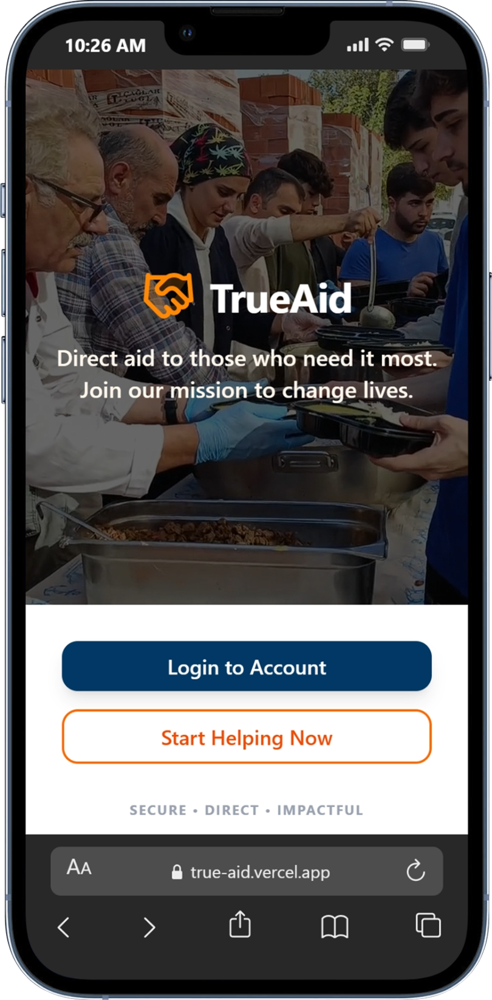

# TrueAid - Lending Hands Abroad

TrueAid is a modern, impact-driven platform designed to connect global generosity with local needs. We specialize in the direct delivery of essential food, healthcare, and humanitarian aid to communities in need around the world.



## 🌍 Our Mission

To bridge the gap between those who want to help and those who need it most, providing a transparent, secure, and efficient way to deliver tangible aid across borders.

## ✨ Key Features

- **Direct Aid Items**: Browse and "purchase" specific aid items like flour, rice, and medical kits.
- **Secure Payments**: Fully integrated with **Stripe Checkout** for safe international transactions.
- **User Authentication**: Secure sign-in and account management powered by **Stack Auth**.
- **Cinematic Experience**: Immersive landing page featuring real-world humanitarian footage.
- **Mobile-First Design**: Optimized for on-the-go giving, with a responsive layout for tablets and desktops.

## 🛠️ Tech Stack

- **Frontend**: React, Vite, Tailwind CSS, Lucide Icons, Framer Motion.
- **Backend**: Node.js, Express (for secure Stripe session handling).
- **Payments**: Stripe API.
- **Auth**: Stack Auth SDK.

## 🚀 Getting Started

### Prerequisites

- Node.js (v18 or higher)
- A Stripe account (for API keys)
- A Stack Auth project

### Installation

1. Clone the repository:
   ```bash
   git clone https://github.com/cloudflips32/TrueAid.git
   cd TrueAid
   ```

2. Install dependencies:
   ```bash
   npm install
   ```

3. Configure Environment Variables:
   Create a `.env` file in the root directory and add your keys:
   ```env
   # Stripe Keys
   STRIPE_SECRET_KEY=sk_test_...
   VITE_STRIPE_PUBLISHABLE_KEY=pk_test_...

   # Stack Auth Keys (Configured in src/stack/client.ts)
   ```

### Running the App

To run both the Vite frontend and the Express backend simultaneously:

```bash
npm run dev:all
```

- **Frontend**: [http://localhost:5173](http://localhost:5173)
- **Backend (API)**: [http://localhost:3001](http://localhost:3001)

## 📁 Project Structure

- `/src`: React frontend application.
- `/server`: Express server for handling Stripe sessions.
- `/public`: Static assets, including the `hero-background.mp4`.
- `/src/app/pages`: Main application views (Landing, Home, Cart, Checkout).
- `/src/app/contexts`: State management for Auth and Cart.

---

*Together, we can make a world of difference.*
